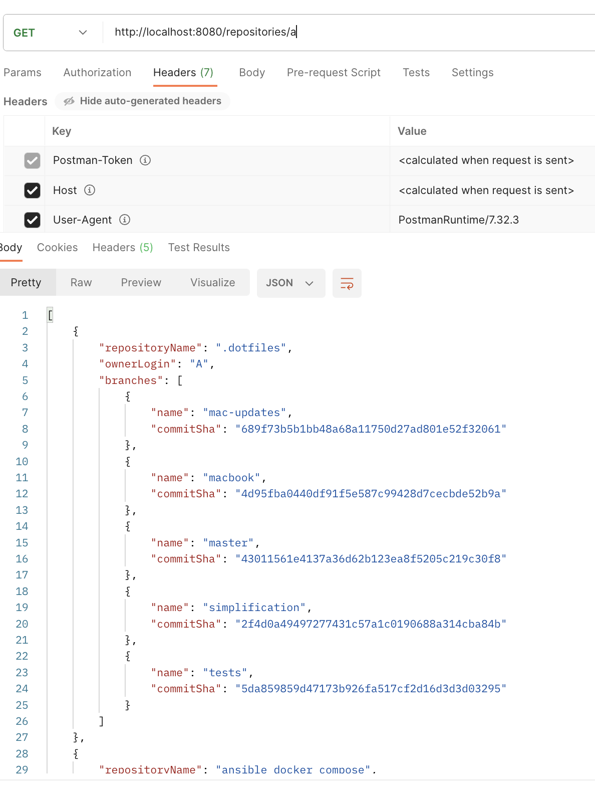

# Atipera task

## Task:

As an api consumer, given username and header “Accept: application/json”, I would like to list all his github repositories, which are not forks. Information, which I require in the response, is:

 

Repository Name

Owner Login

For each branch it’s name and last commit sha

 

As an api consumer, given not existing github user, I would like to receive 404 response in such a format:

{

    “status”: ${responseCode}

    “message”: ${whyHasItHappened}

}

 

Notes:

Please full-fill the given acceptance criteria, delivering us your best code compliant with industry standards.

Please use https://developer.github.com/v3 as a backing API

Application should have a proper README.md file

## Methods

### RepositoryController

- `getUserRepositories`: This method is used to get list of repositories from service

### RepositoryService

- `getUserRepositories`: This method is used to get list of repositories from github api

## Screenshots

Here are some screenshots of the application:

## Setup

You can run the project using docker:

go to the project folder and run ,,docker compose up"

You can user the api using with sending get request to:
http://localhost:8080/repositories/{username}

## Testing

Methods from controller and service have 100% line and method coverage